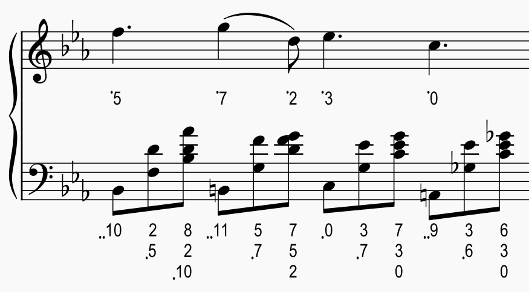
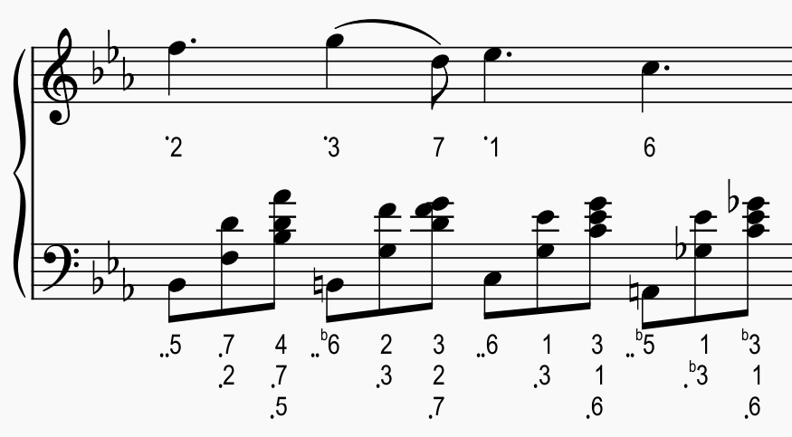

MuseScore plugin to add integer notation (pitch class / chromatic scale) or numbered notation (Jianpu).

_Experimental, likely to have issues._ Developed on MuseScore v4 but may also work on v3.

Based on [Jianpu Numbered Notation](https://musescore.org/en/project/jianpu-numbered-notation-0) plugin. Credit to the original author.

#### Screenshot

Taken from [Nocturne Op.9 No.2 in E♭ Major](https://musescore.com/user/6662591/scores/4383881) by Chopin

0 = C (pitch class)\
dots indicate octaves above / below reference note C4

0 = E♭ (tonic)

1 = E♭ (Jianpu)
